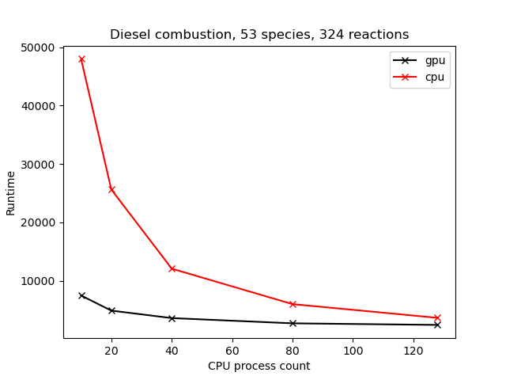
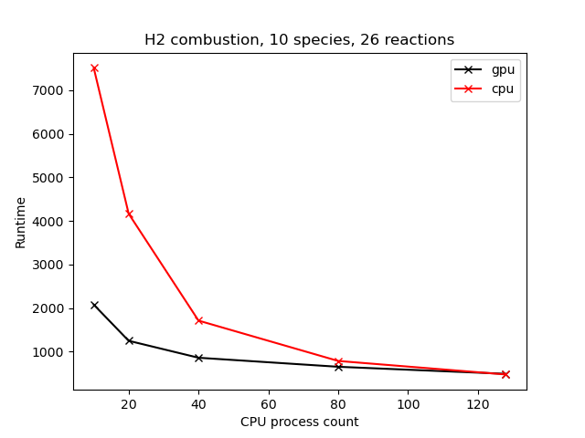
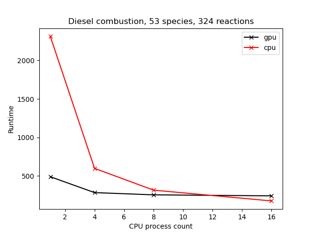
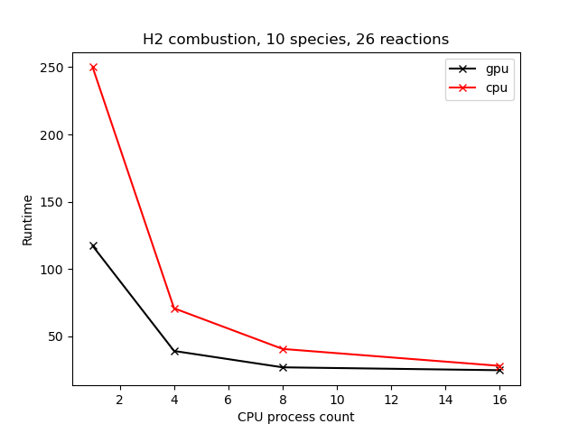

# gpu_chemistry


## Performance

**Note!** When running the gpuChemistryModel using multiple mpi-processes, make sure to enable nvidia-cuda-mps to ensure that the cpu processes use gpu resources concurrently. The scheduler can be launched without root use privileges by:
```
nvidia-cuda-mps-control -f > my_mps_output.log&
```

Some performance results are presented below. The results are from ```../tutorials/scalingTest``` which solves a simple shear layer combustion case in a cubic domain. The cell count in the test case is N=100^3 for the HPC node test and N=30^3 in the desktop PC case. As can be seen, the GPU implementation is faster, especially, when the number of cells per mpi process is high.

##### On a HPC node: 2 x AMD Rome 7H12 CPU (128 CPU cores) with 4 x A100 GPU



##### On Desktop PC: With AMD Ryzen Threadripper 3960X (24 CPU cores) with a RTX 3080Ti GPU



## Supported features
Not everything from the official OpenFOAM release is supported. If you need more support for features, please make a feature request.

#### Supported thermo models
Currently, the following thermodynamics model combination is supported.

```
thermoType
{
    type            heRhoThermo / hePsiThermo;
    mixture         <SomeMultiComponentMixture>;
    transport       <SomeTransportType>;
    thermo          janaf;
    energy          sensibleEnthalpy;
    equationOfState perfectGas;
    specie          specie;
}
```
This solves the energy equation for sensible enthalpy and the transport properties are computed based on any of the available transport models in stock OpenFOAM. Heat capacity is taken from Janaf polynomials and the ideal gas law is assumed for the density.


#### Supported ODE solvers
* Rosenbrock12
* Rosenbrock23
* Rosenbrock34

Only the Rosenbrock family of ODE solvers is supported at this point.


#### Supported reaction types
The following list of reactions are supported:

* reversibleArrhenius
* irreversibleArrhenius
* reversibleThirdBodyArrhenius
* reversibleArrheniusLindemannFallOff
* reversibleArrheniusTroeFallOff


